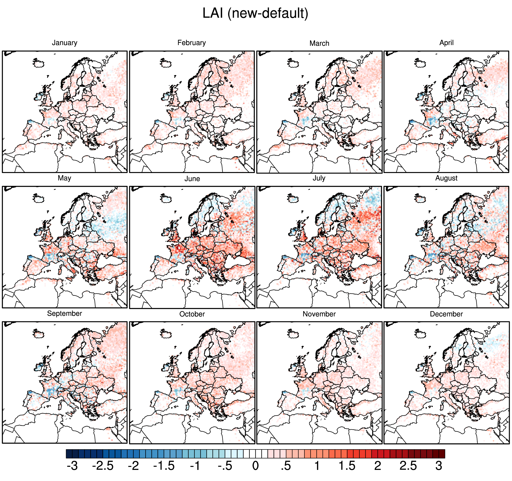

# lai4wrf

**Preparation of LAI from SPOT observations downloaded from C3S database for the period 2004-2013 for WRF simulations** 

The repository contans Leaf Area Index (LAI) processed data that can be used for running WRF. The processed data are based on SPOT satellite observations at 1km scale downloaded from [C3S database](https://cds.climate.copernicus.eu/cdsapp#!/dataset/satellite-lai-fapar?tab=form).

Procedures undertaken to process the LAI data:

A) To obtain table values (e.g. see an example for [Europe](./EUR11/tables))
1. Download data from C3S databas, and _untar_ the files. Data available at 3 days per month per year.
2. Calculate montlhy mean per each year using Climate Data Operator ([cdo](https://code.mpimet.mpg.de/projects/cdo)), merge data per month over all years, and calculalate monthly mean over the whole period 
3. Run geogrid.exe over European doman at 4km to obtain geo_em.d01.nc 
4. Land use (variable name in WRF = LU_INDEX) from geo_em.d01.nc intepolated to 1km grid of LAI observations using nearest-neigbour method with cdo
5. Calculate mean per category for each month, which gives tabular values that can be used in WRF

B) To obtain LAI maps for EUR11 CORDEX domain (e.g. see as an example geo_em files for [Europe](./EUR11/geo__em__files))
1. As 1. in A)
2. As 2. in A)
3. Run geogrid.exe over a predefined doman at selected resolution (e.g. 11km for CORDEX-EUR11) to obtain geo_em.d01.nc
4. Interpolate LAI montly means (obtained in the step 2.) to WRF geo_em.d01.nc grid using conservation remapping with [cdo](https://code.mpimet.mpg.de/projects/cdo)
5. Fill the missing data (in the far north of the EUR11 domain) with the LAI values from the default MODIS maps (LAI12M in geo_em.d01.nc). 
6. Replace LAI12M in geo_em.d01.nc with the new values obtained from the SPOT obeservations.

NOTE:
For table values for EUR11 domain also version v03 of the SPOT data was processed. As it was shown that these values are unrealistically low, only v01 was additionally processed and used for creating the maps. 

All the scripts and programs, with additional descriptions to follow the all above-mentioned steps are given in the folder [scripts](./scripts).
The results for the EUR11 domain are given in the folder [EUR11](./EUR11).

Bellow you can see the comparison (check [plot_2D_LAI.py](scripts/plot_2D_LAI.py)) of monthly mean values between new LAI obtained from the 10-year SPOT observations and the default monthly mean LAI maps available in WRF: 
